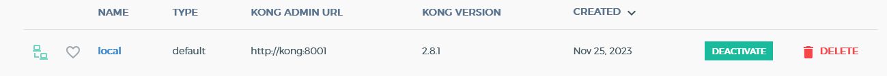
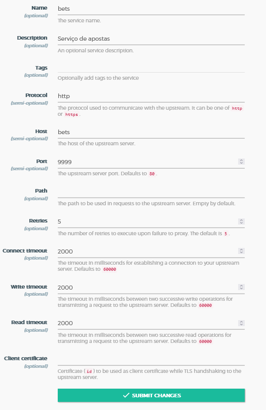

# Ambiente Kong API Gateway

Ambiente de execucao do Kong API Gateway usando ferramenta docker-compose

## Ferramentas necessarias
* docker
* docker-compose
* editor *.yaml


## Ferramentas que serao provisionadas usando o docker-compose
* Fluent-Bit
* Kibana
* ElasticSearch
* Jaeger
* Grafana
* Prometheus
* Prometheus Node Exporter

### Arquivos de configuracao fluent-bit

Na pasta [fluent-bit](compose/fluent-bit) contem os arquivos necessarios para configuracao da ferramenta, o docker-compose utilizara esta pasta para montar as configuracoes


### Arquivos de configuracao prometheus

Na pasta [prom-conf](compose/prom-conf) contem os arquivos necessarios para configuracao do prometheus, inclusive a configuracao de _scraping_ das metricas do Kong API Gateway


## Rodando

Na pasta raiz do projeto voce pode executar

```shell
docker-compose -f compose/kong_compose.yml up -d
```

### Adicionando Rota do kong
Ao acessar o konga via `http://localhost:1337`, deve-se configurar o endereço do kong para administrar.

```
name: local
http://kong:8001
```


### Cadastrando um novo service




### Cadastrando uma nova rota
Exemplo para cadastro dos dados de uma nova rota


## Plugins
Um pedoço de software que pode ser executado dentro de um ciclo de vida de uma requisição HTTP, tanto na fase de request quanto no respose.<br>
Podem ser configurados nas Rotas, Serviços, Consumers e Globalmente, atente-se a precedência das configurações.

Você pode criar ser plugin utilizando a linguagem lua, javascript e golang.<br>
Kong API Gateway possui alguns plugins da comunidade que podem ser instalado na versão community

### Monitoramento
Utilizar o prometheus para buscar as métricas no serviçom, o grafana, node_exporter para coletar métricas do ecosistema, 


### Logging
Utilizar o plugin `tcp-log` do kong.
Depende do fluent-bit para entregar, elasticsearch para enviar os logs e kibana para visualizar.


### Tracing Distribuido
Utilizar o Jaeger para fazer o tracing integrado com o konga.
1.0 é pesado 0.001 é um número bom para produção.
Utilizar o plugin `Zipkin`.

